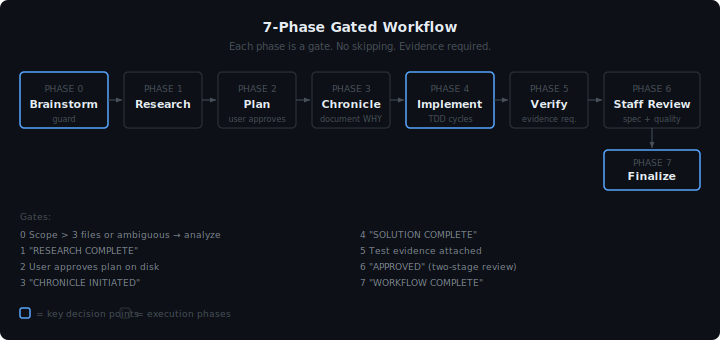
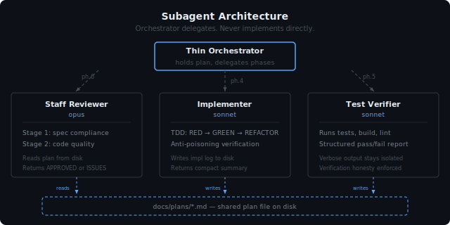

# development-skills

A Claude Code plugin that turns your AI agent into a disciplined software engineer.

<a href="https://github.com/reidemeister94/development-skills/releases"></a>
<a href="LICENSE"></a>
<a href="https://github.com/reidemeister94/development-skills/stargazers"></a>

---

## Installation

```bash
/plugin marketplace add reidemeister94/development-skills
/plugin install development-skills@development-skills
```

Activates automatically on any coding task. No configuration needed.

---



## What It Does

AI agents are fast but undisciplined — [67% of developers](https://addyo.substack.com/p/the-80-problem-in-agentic-coding) spend *more* time debugging AI-generated code than writing it. This plugin enforces a mandatory gated workflow: research before planning, plan before coding, test before shipping, review before merging. Every time.



Three subagents handle specialized work: an **Implementer** (TDD cycles), a **Test Verifier** (structured pass/fail), and a **Staff Reviewer** (two-stage code review). The orchestrator delegates but never implements directly.



Small tasks (3 files or fewer, single obvious approach) get a fast track — same quality checks, no ceremony.

---

## Plans and Chronicles

Every task produces persistent artifacts on disk, numbered incrementally like SQL migrations (`0001`, `0002`, ...). Context windows get compacted. These files don't.

**Plan files** (`docs/plans/0042__2026-03-15__implementation_plan__auth-refactor.md`) are the single source of truth for a task. They accumulate across phases: research notes, implementation checklist, verification results, review log. Subagents read from and write to the same plan file. When the context window clears, the agent picks up where it left off by reading the plan.

**Chronicles** (`docs/chronicles/0042__2026-03-15__auth-refactor.md`) capture what code and plans don't — **WHY**. The user's original request, the business context behind it, rejected alternatives, discoveries made during implementation. Without chronicles, a conversation with Claude disappears when the session ends. With chronicles, the reasoning survives: why cursor-based pagination instead of offset, why the auth middleware was rewritten, why a simpler approach was rejected.

```
Code + Git    →  WHAT changed    (diffs)
Plan files    →  HOW it was built (steps, checklist, verification)
Chronicles    →  WHY it happened  (intent, context, decisions)
```

Full details on templates and lifecycle in the **[in-depth guide](docs/GUIDE.md)**.

---

## Skill Highlights

This section highlights commonly used skills in the `development-skills` plugin and is not an exhaustive inventory.

**Workflow** — `core-dev` (auto-activates), `brainstorming`, `debugging`, `chronicles`

**Languages** — `python-dev`, `java-dev`, `typescript-dev`, `frontend-dev`, `swift-dev`

**Testing** — `create-test`, `eval-regression`

**Utilities** — `commit`, `distill`, `align-docs`, `create-skills`, `get-api-docs`, `update-precommit`, `update-reqs` (use `requirements-dev.in` for dev deps)

Auto-format on save via hooks: ruff (Python), biome (JS/TS), google-java-format, swift-format, prettier.

Full details in the **[in-depth guide](docs/GUIDE.md)**.

---

## Acknowledgments

Draws inspiration from [superpowers](https://github.com/obra/superpowers) by Jesse Vincent — spec-first brainstorming, subagent-per-task dispatch with two-stage review, bite-sized TDD plans, and git worktree isolation.

Where development-skills diverges: **language-specific engineering patterns** (5 languages with framework-level guidance), **context engineering** (observation masking, progressive phase loading), and a **chronicles** layer for capturing WHY decisions were made.

---

## Further Reading

- [How I Taught Agents to Follow a Process, Not Just Write Code](https://medium.com/@silvio.pavanetto/how-i-taught-agents-to-follow-a-process-not-just-write-code-b135b6573c54) — the full story
- [Effective Context Engineering for AI Agents](https://www.anthropic.com/engineering/effective-context-engineering-for-ai-agents) — the patterns we implement
- [TDD, AI Agents and Coding with Kent Beck](https://newsletter.pragmaticengineer.com/p/tdd-ai-agents-and-coding-with-kent) — why testing matters more with AI

---

## Contributing

Contributions welcome — especially new language skills (Rust, Go, Kotlin, Ruby, C#). See [CONTRIBUTING.md](CONTRIBUTING.md).

No PR without a passing `/eval-regression`. Open an issue first.

## License

MIT
