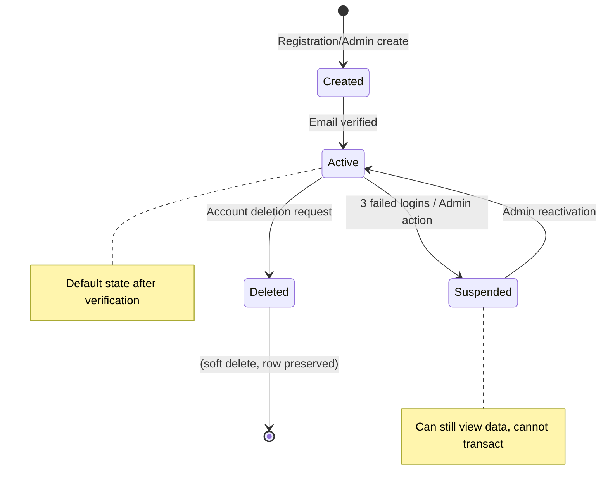
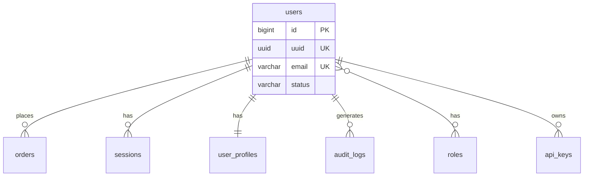

# Entity Documentation Template

Use this template for each entity file in `docs/data-model/{entity_name}.md`.

**CRITICAL**: The documentation must be EXHAUSTIVE. Reading this document must be equivalent to reading the DDL and all related code. A developer should be able to recreate the entity with complete fidelity from this documentation alone.

**TRUTH REQUIREMENT**: Every fact must be verified from source. If you cannot verify something, mark it as `[UNVERIFIED]` or `(inferred)`. NEVER invent table names, field names, or types.

---

## Before You Write: Truth Checklist

- [ ] I have READ the actual DDL/schema definition (not just code that references it)
- [ ] Every table/field name I write EXACTLY matches the source
- [ ] For legacy systems (AS400, etc.): I have the DDS/DDL, not just integration code
- [ ] Business meanings are marked as "(verified from docs)" or "(inferred from usage)"
- [ ] Anything I couldn't verify is marked `[UNVERIFIED]`

---

## Template Structure

```markdown
# {Entity Name}

> **Source**: `{path/to/ddl.sql}:{line_number}`
> **Database**: {database_name} (PostgreSQL/MySQL/etc.)
> **Schema**: {schema_name} (if applicable)

## Business Definition

{Comprehensive explanation of what this entity represents. Not "stores user data" but the complete business meaning.}

### Business Context

{Answer these questions in prose:}

1. **What is this in the real world?** {e.g., "A User represents a person who has registered an account. Each person has exactly one User record, regardless of how they signed up (web, mobile, SSO)."}

2. **When is a record created?** {Describe the exact circumstances: "Created when a user completes registration (see `auth_service.py:234`), or when an admin creates an account manually (see `admin_api.py:567`), or when SSO creates a shadow account (see `sso_handler.py:89`)."}

3. **When is a record modified?** {List all scenarios: "Modified when: user updates profile, user changes password, admin updates status, system updates last_login timestamp, etc."}

4. **Is a record ever deleted?** {Be specific: "Soft deleted by setting `deleted_at` timestamp - row is preserved for audit. Hard deletion only via GDPR data erasure request (see `gdpr_service.py:123`). Related data handling: orders are preserved with user_id nullified, sessions are hard deleted."}

5. **What business rules govern this entity?** {e.g., "Email must be unique (case-insensitive). User cannot be deleted if they have unpaid orders. Status transitions are constrained: active→suspended→active allowed, but deleted is terminal."}

## Data Lifecycle



### Lifecycle Details

| Transition | Trigger | Code Reference | Side Effects |
|------------|---------|----------------|--------------|
| Created → Active | Email verification link clicked | `auth_service.py:178` | Welcome email sent, analytics event |
| Active → Suspended | 3 failed login attempts | `auth_service.py:145` | Session invalidated, alert to admin |
| Suspended → Active | Admin clicks "Reactivate" | `admin_api.py:234` | User notified, login attempts reset |
| Active → Deleted | User confirms deletion | `account_service.py:456` | Related data anonymized, GDPR log |

## Attributes

### Complete Attribute Reference

| Attribute | Type | Null | Default | Description |
|-----------|------|------|---------|-------------|
| `id` | BIGINT | NO | AUTO_INCREMENT | Primary key, surrogate. Never exposed to users. |
| `uuid` | UUID | NO | gen_random_uuid() | Public identifier, used in URLs and APIs. |
| `email` | VARCHAR(255) | NO | - | User's email, case-insensitive unique (see constraint). Business identifier. |
| `name` | VARCHAR(255) | YES | NULL | Display name, shown in UI. Can be NULL for SSO users before first profile edit. |
| `status` | VARCHAR(20) | NO | 'pending' | Enum: 'pending', 'active', 'suspended', 'deleted'. See lifecycle diagram. |
| `password_hash` | VARCHAR(255) | YES | NULL | bcrypt hash. NULL for SSO-only users. Never exposed in API responses. |
| `created_at` | TIMESTAMP | NO | NOW() | Record creation time, UTC. Immutable after creation. |
| `updated_at` | TIMESTAMP | NO | NOW() | Last modification time, UTC. Auto-updated by trigger (see `triggers.sql:34`). |
| `deleted_at` | TIMESTAMP | YES | NULL | Soft delete timestamp. NULL = not deleted. When set, user is "deleted". |
| `metadata` | JSONB | YES | '{}' | Flexible storage for non-critical data. Structure documented below. |

### Attribute Details

#### `email`

**Business Meaning**: The user's email address, used for:
- Login (primary identifier)
- Notifications (password reset, order confirmations)
- Account recovery
- Communication preferences

**Constraints**:
- Unique across all non-deleted users (constraint: `idx_users_email_active`)
- Case-insensitive comparison (collation: `CITEXT` extension)
- Max 255 characters (RFC 5321 compliant)
- Validated format on application layer (`validators.py:45`)

**Update Rules**:
- Can be changed by user (requires email verification flow)
- Old email retained in `email_history` table for 30 days
- Cannot reuse a recently used email (90 day cooldown)

**Code References**:
- Validation: `validators.py:45-67`
- Update flow: `account_service.py:234-289`
- Uniqueness check: `user_repository.py:78`

#### `status`

**Business Meaning**: Controls what the user can and cannot do in the system.

**Valid Values**:

| Value | Meaning | User Can Do | User Cannot Do |
|-------|---------|-------------|----------------|
| `pending` | Registered but email not verified | View registration confirmation page | Login, access any feature |
| `active` | Normal active user | Everything allowed for their role | N/A |
| `suspended` | Temporarily disabled | Login and view data | Make purchases, modify settings |
| `deleted` | Account deleted (soft) | Nothing (cannot login) | Everything |

**Transition Rules** (enforced in `user_service.py:123`):
```
pending → active (email verification)
active → suspended (admin action OR 3 failed logins)
suspended → active (admin action only)
active → deleted (user request + confirmation)
suspended → deleted (user request OR admin action)
```

**Invalid Transitions** (will raise `InvalidStatusTransition`):
- pending → suspended (must verify first)
- deleted → any (deletion is terminal)
- any → pending (cannot un-verify)

#### `metadata` (JSONB)

**Structure**:
```json
{
  "preferences": {
    "theme": "dark|light",           // UI theme preference
    "language": "en|it|de",          // ISO 639-1 code
    "notifications": {
      "email_marketing": true,       // Marketing emails opt-in
      "email_transactional": true,   // Cannot be false for active users
      "push_enabled": false          // Mobile push notifications
    }
  },
  "tracking": {
    "login_count": 42,               // Total successful logins
    "last_login_ip": "192.168.1.1",  // IP of last login (privacy: deleted after 90 days)
    "last_login_at": "2024-01-15T10:30:00Z",  // Timestamp of last login
    "signup_source": "web|mobile|api|sso"     // How user registered
  },
  "internal": {
    "support_notes": "...",          // Admin-only notes
    "flags": ["beta_tester", "vip"]  // Feature flags
  }
}
```

**Access Control**:
- `preferences`: User can read/write via profile API
- `tracking`: User can read, system writes (automated)
- `internal`: Admin only, never exposed to user

**Code References**:
- Read: `user_repository.py:123`
- Update preferences: `account_service.py:345`
- Update tracking: `auth_service.py:234`
- Admin access: `admin_api.py:678`

## Relationships

### Relationship Map



### Detailed Relationships

#### users → orders (1:N)

**Relationship**: One user can place many orders. Each order belongs to exactly one user.

**Foreign Key**: `orders.user_id → users.id`

**Cascade Behavior**:
- ON DELETE: SET NULL (orders preserved for accounting, user reference removed)
- ON UPDATE: CASCADE

**Business Rules**:
- User must be `active` to create new orders
- Historical orders remain visible to suspended users
- Deleted users' orders remain in system but `user_id` is NULL

**Code References**:
- Order creation: `order_service.py:89` (checks user status)
- User deletion handling: `account_service.py:456` (nullifies user_id)

#### users ↔ roles (N:M)

**Relationship**: Users can have multiple roles. Roles can be assigned to multiple users.

**Junction Table**: `user_roles` (see separate documentation)

**Business Rules**:
- Every user has at least the `user` role (default, cannot be removed)
- `admin` role grants access to admin panel
- Roles are additive (permissions are unioned)

**Code References**:
- Role assignment: `admin_api.py:234`
- Permission check: `auth_middleware.py:56`

#### users → sessions (1:N)

**Relationship**: One user can have multiple active sessions (multi-device support).

**Foreign Key**: `sessions.user_id → users.id`

**Cascade Behavior**:
- ON DELETE: CASCADE (delete user = delete all sessions)

**Business Rules**:
- Max 5 concurrent sessions per user (configurable: `config.MAX_SESSIONS`)
- Creating 6th session invalidates oldest
- All sessions invalidated on password change

**Code References**:
- Session creation: `auth_service.py:178`
- Session limit enforcement: `session_service.py:89`

## Indexes

| Index Name | Columns | Type | Purpose | Query Example |
|------------|---------|------|---------|---------------|
| `pk_users` | `id` | PRIMARY | Row lookup by ID | `SELECT * FROM users WHERE id = ?` |
| `idx_users_uuid` | `uuid` | UNIQUE | API lookups | `GET /api/users/{uuid}` |
| `idx_users_email_active` | `email` WHERE `deleted_at IS NULL` | UNIQUE PARTIAL | Login, uniqueness | `SELECT * FROM users WHERE email = ? AND deleted_at IS NULL` |
| `idx_users_status` | `status` | BTREE | Admin filtering | `SELECT * FROM users WHERE status = 'suspended'` |
| `idx_users_created` | `created_at` | BTREE | Analytics, sorting | `SELECT * FROM users ORDER BY created_at DESC` |

### Index Notes

- **`idx_users_email_active`**: Partial index excluding deleted users. This allows email reuse after deletion (GDPR compliance) while maintaining uniqueness for active accounts.
- No index on `name` - full-text search uses Elasticsearch instead (see `search_service.py`)

## Constraints

| Constraint | Type | Definition | Business Rule |
|------------|------|------------|---------------|
| `pk_users` | PRIMARY KEY | `id` | Every user has unique ID |
| `uk_users_uuid` | UNIQUE | `uuid` | UUID is globally unique |
| `uk_users_email_active` | UNIQUE | `email` WHERE `deleted_at IS NULL` | No duplicate emails for active users |
| `chk_users_status` | CHECK | `status IN ('pending', 'active', 'suspended', 'deleted')` | Status must be valid enum value |
| `chk_users_email_format` | CHECK | `email ~* '^[A-Za-z0-9._%+-]+@[A-Za-z0-9.-]+\.[A-Za-z]{2,}$'` | Basic email format validation |

## Sample Data

```sql
-- Example records demonstrating different states
SELECT id, uuid, email, status, created_at, metadata->>'tracking' as tracking
FROM users
WHERE id IN (1, 2, 3);
```

| id | uuid | email | status | created_at | tracking |
|----|------|-------|--------|------------|----------|
| 1 | a1b2c3d4-... | admin@example.com | active | 2023-01-01 | {"login_count": 500, "signup_source": "web"} |
| 2 | e5f6g7h8-... | user@example.com | active | 2024-01-15 | {"login_count": 12, "signup_source": "mobile"} |
| 3 | i9j0k1l2-... | suspended@example.com | suspended | 2024-02-01 | {"login_count": 3, "signup_source": "sso"} |

## Usage in Codebase

### ETL Pipeline

| Step | Operation | Details | Code Reference |
|------|-----------|---------|----------------|
| Step 3: User Sync | READ | Syncs users to data warehouse nightly | `main.py:345-378` |
| Step 7: Cleanup | UPDATE | Sets status='deleted' for inactive users (>2 years) | `main.py:890-923` |

### API Endpoints

| Endpoint | Operation | Details | Code Reference |
|----------|-----------|---------|----------------|
| `GET /api/users/{uuid}` | READ | Returns user profile | `api/users.py:45` |
| `PATCH /api/users/{uuid}` | UPDATE | Updates profile fields | `api/users.py:89` |
| `DELETE /api/users/{uuid}` | UPDATE | Soft deletes user | `api/users.py:134` |
| `GET /api/admin/users` | READ | Lists users with filters | `api/admin.py:23` |

### Services

| Service | Usage | Details | Code Reference |
|---------|-------|---------|----------------|
| `AuthService` | READ/UPDATE | Login, password management | `services/auth.py:34-200` |
| `AccountService` | ALL | Profile management, deletion | `services/account.py:23-456` |
| `NotificationService` | READ | Fetches email preferences | `services/notification.py:78` |

## Related Documentation

- [orders](./orders.md) - Orders placed by users
- [sessions](./sessions.md) - User login sessions
- [user_roles](./user_roles.md) - Junction table for role assignment
- [API: User Endpoints](../workflows/api/get-api-users.md) - API documentation
- [ETL: User Sync](../workflows/etl/step-03-user-sync.md) - Data warehouse sync
```

---

## Writing Guidelines

1. **Truth First**: NEVER write something you didn't verify from source
2. **Exact Names**: Use EXACT table/field names from DDL - no translations
3. **Business First**: Always explain the business meaning before technical details
4. **Complete Lifecycle**: Document creation, modification, and deletion scenarios
5. **Every Attribute**: Don't skip any column, even "obvious" ones like `created_at`
6. **Enum Exhaustiveness**: For status-like fields, document ALL valid values and their meanings
7. **JSONB Depth**: Document JSON structure with examples and access control
8. **Relationship Context**: Don't just list FK - explain business meaning and cascade effects
9. **Code References**: Every significant behavior must have `file:line` reference
10. **Usage Map**: Show where entity is used in ETL, APIs, services
11. **Mark Inferences**: Clearly distinguish verified facts from inferred meanings

## Common Mistakes to Avoid

- DON'T invent table or field names - use EXACT names from source
- DON'T translate legacy names (AS400 `CUSMST` stays `CUSMST`, not "Customer Master")
- DON'T guess field types - verify from DDL
- DON'T write "stores user data" - write the complete business definition
- DON'T skip "obvious" attributes - document them all
- DON'T list relationships without cascade behavior
- DON'T document JSON fields without structure example
- DON'T omit status/enum valid values and transition rules
- DON'T forget to document soft delete behavior
- DON'T skip index explanations (why this index exists)
- DON'T leave any "TBD" or "TODO" markers
- DON'T proceed with unverified legacy system details - ASK FIRST

## Legacy System (AS400/SAP/Mainframe) Special Rules

When documenting entities from legacy systems:

1. **MUST have actual DDL/DDS** - integration code alone is NOT sufficient
2. **Use exact legacy names** - even if cryptic (e.g., `ORDHDP`, not "Order Header")
3. **Mark business meanings as inferred** if not from official documentation
4. **Include library/schema** for AS400 (e.g., `PRODLIB.CUSMST`)
5. **If DDL unavailable**, create a section like:

```markdown
## [UNVERIFIED] Legacy Entity: CUSMST

**⚠️ AS400 DDL NOT AVAILABLE - Documentation based on integration code only**

### Verified from integration code (`sync.py:45-89`):
- Table name: `CUSMST` (HIGH confidence)
- Fields used: `CUSID`, `CUSNM`, `CUSADR`

### NOT VERIFIED (need AS400 DDL):
- Complete field list
- Field types and sizes
- Constraints and indexes
- Business field descriptions
```
