# Mermaid Diagram Patterns

Reference patterns for creating consistent diagrams across documentation.

---

## ER Diagrams (Entity Relationships)

### Full Project ER Diagram

Use in `docs/data-model/_overview.md`:

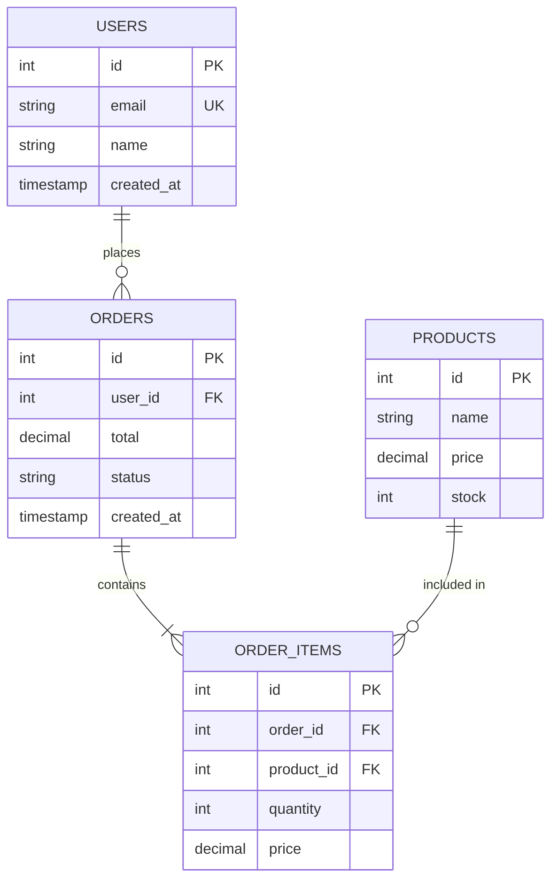

### Relationship Cardinality Symbols

| Symbol | Meaning |
|--------|---------|
| `\|\|` | Exactly one |
| `o\|` | Zero or one |
| `}o` | Zero or many |
| `}\|` | One or many |
| `\|{` | One or many (other direction) |
| `o{` | Zero or many (other direction) |

### Common Relationship Patterns

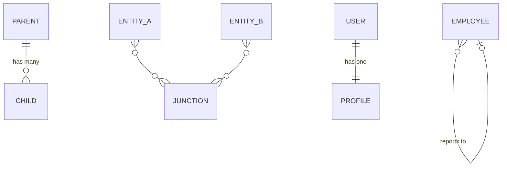

---

## Flowcharts (ETL Pipeline)

### Pipeline Overview

Use in `docs/workflows/etl/_pipeline-overview.md`:

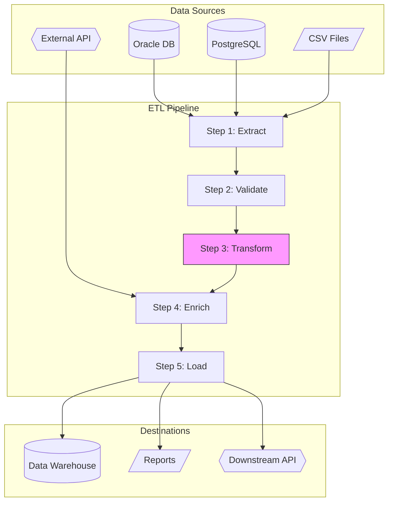

### Single Step Detail

Use in individual step files:

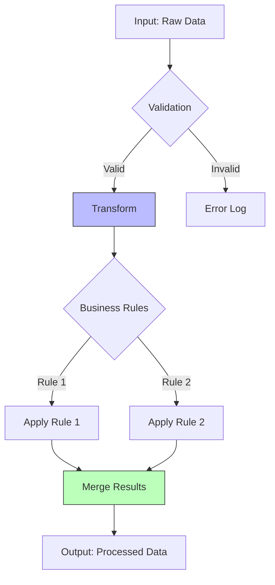

### Parallel Processing

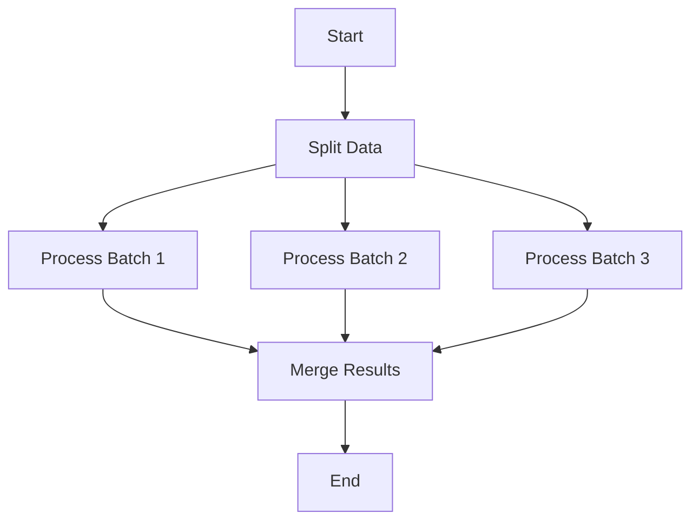

---

## Sequence Diagrams (API Flows)

### Basic API Request

Use in API endpoint documentation:

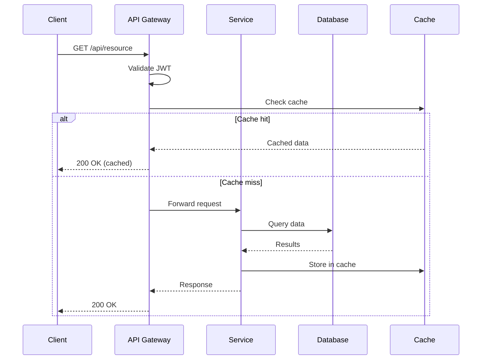

### Complex Transaction

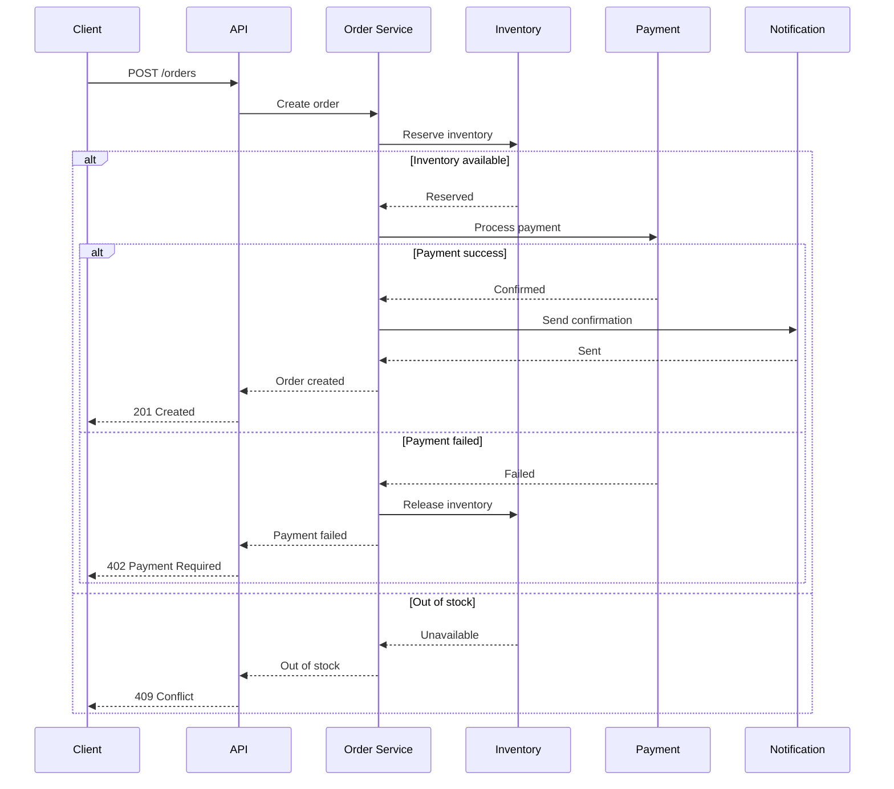

---

## State Diagrams (Entity Lifecycle)

### Order Status Flow

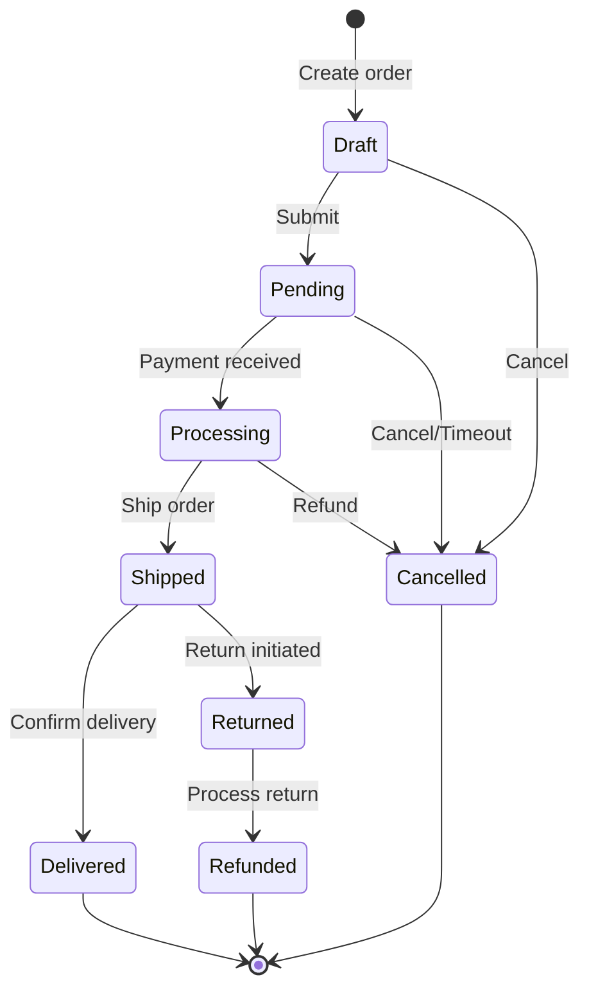

---

## Class Diagrams (Code Structure)

### Service Architecture

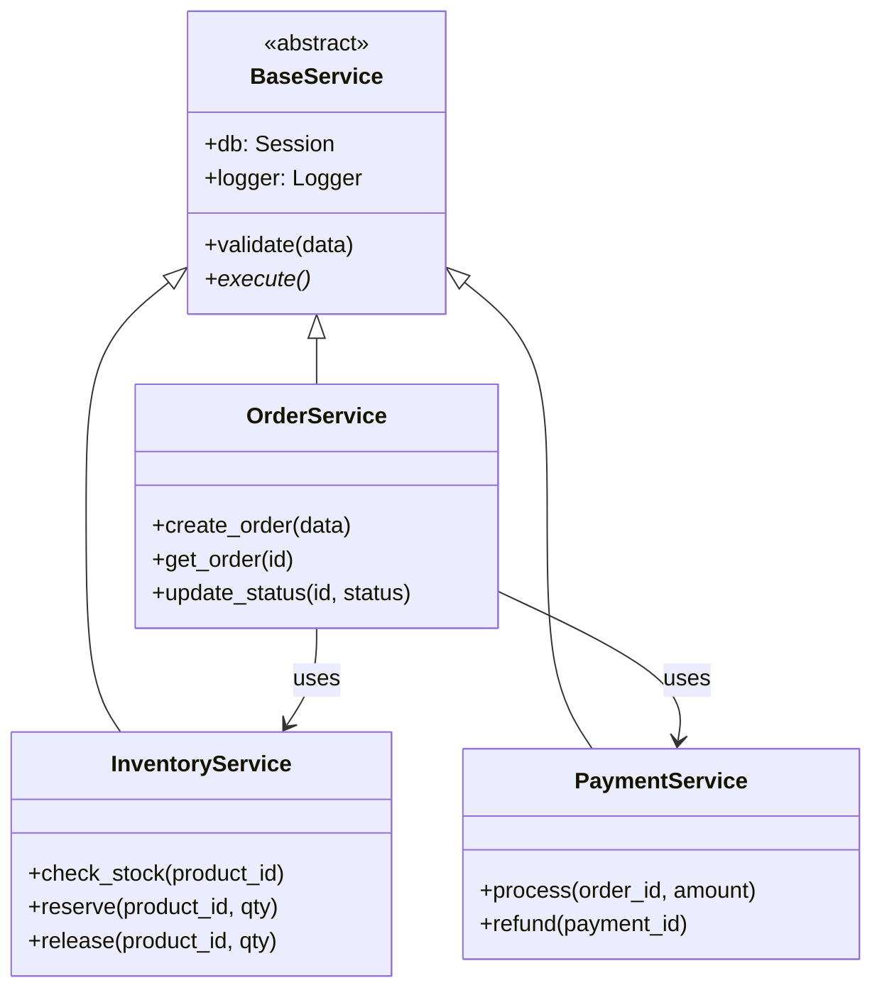

---

## Styling Guidelines

### Color Conventions

| Element | Color | Hex | Use For |
|---------|-------|-----|---------|
| Current/Focus | Pink | `#f9f` | Highlighted element |
| Input | Light blue | `#bbf` | Data sources |
| Output | Light green | `#bfb` | Data destinations |
| Error | Light red | `#fbb` | Error paths |
| Success | Light green | `#bfb` | Success paths |

### Applying Styles

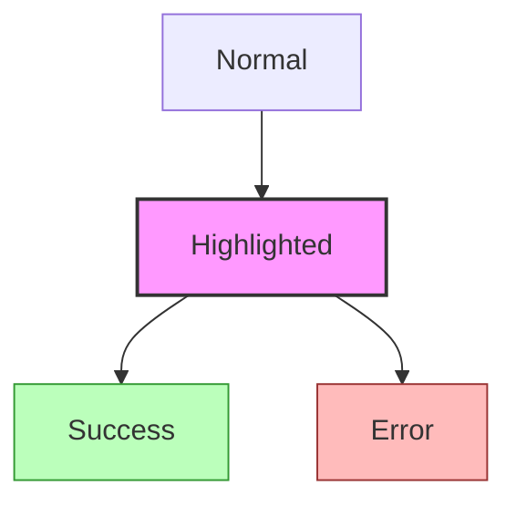

### Subgraph Styling

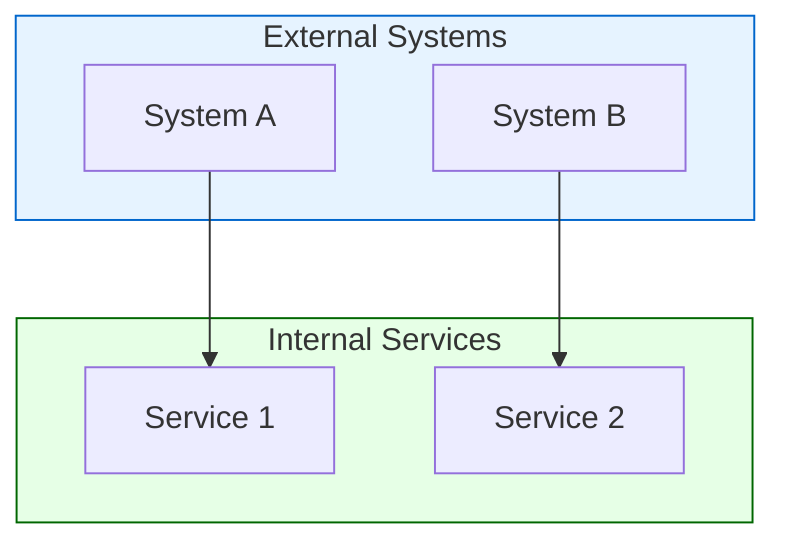

---

## Tips

1. **Keep diagrams focused**: One concept per diagram
2. **Use consistent naming**: Match entity/table names exactly
3. **Add legends** when using custom colors
4. **Test rendering**: Mermaid syntax can be finicky
5. **Prefer flowcharts** for processes, ER for data, sequence for interactions
