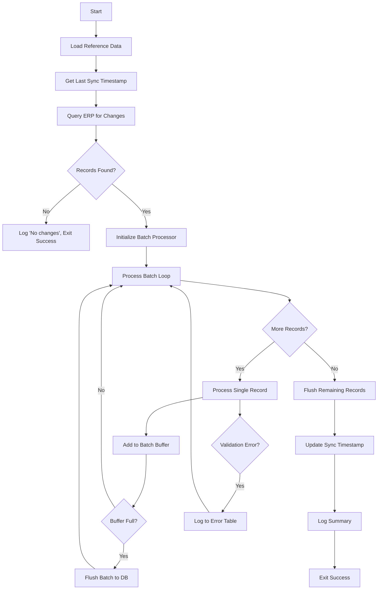

# ETL Workflow Step Documentation Template

Use this template for each ETL step file in `docs/workflows/etl/step-{NN}-{name}.md`.

**CRITICAL**: This documentation must be the **written form of the code**. Someone reading this document must be able to reimplement the step in any programming language without looking at the original code. Every line of logic must be explained.

**TRUTH REQUIREMENT**: Every fact must be verified from source code. NEVER invent or guess:
- Table/field names (especially for legacy systems like AS400)
- SQL queries or logic you haven't read
- Transformation rules you haven't verified

If uncertain about any detail, mark it `[UNVERIFIED]` and ask for clarification.

---

## Before You Write: Truth Checklist

- [ ] I have READ the actual source code for this step
- [ ] Every table/field name EXACTLY matches what's in the code
- [ ] SQL queries shown are COPIED from source, not reconstructed
- [ ] For legacy system integrations: I note what's verified vs inferred
- [ ] Transformation logic is explained line-by-line from actual code

---

## Template Structure

```markdown
# Step {N}: {Descriptive Name}

> **Source**: `{file.py}:{start_line}-{end_line}`
> **Function**: `{function_name}()`
> **Estimated Runtime**: {typical duration}
> **Last Modified**: {date} by {author} - {reason}

## Executive Summary

{3-5 sentences that answer: What does this step accomplish? Why does it exist? What would break if it didn't run?}

Example:
"This step synchronizes customer data from the legacy Oracle ERP to our PostgreSQL operational database. It runs nightly at 02:00 UTC and processes approximately 50,000 customer records. The sync is incremental - only records modified since the last run are processed. If this step fails, customer data in the operational database becomes stale, affecting order processing and customer service operations. The step includes conflict resolution: ERP is the source of truth for demographic data, but our system's `preferences` field is never overwritten."

## Position in Pipeline

### Pipeline Context

```mermaid
flowchart TB
    subgraph Before["Prerequisites"]
        P1[Step {N-1}: {name}]
        P2[Step {N-2}: {name}]
    end

    subgraph Current["This Step"]
        C[Step {N}: {name}]
    end

    subgraph After["Dependents"]
        A1[Step {N+1}: {name}]
        A2[Step {N+2}: {name}]
    end

    P1 --> C
    P2 -.-> C
    C --> A1
    C --> A2

    style C fill:#f9f,stroke:#333,stroke-width:2px
```

### Dependency Matrix

| Aspect | Value | Details |
|--------|-------|---------|
| **Hard Dependencies** | Step {N-1} | Must complete successfully; uses its output table `staging.processed_orders` |
| **Soft Dependencies** | Step {N-2} | Preferred but not required; will use cached data if unavailable |
| **Required By** | Step {N+1}, {N+3} | These steps will fail if this step doesn't complete |
| **Can Run Standalone** | Yes/No | {Explain: e.g., "Yes, if staging tables are pre-populated manually"} |
| **Idempotent** | Yes/No | {Explain: e.g., "Yes, uses UPSERT; can be re-run safely"} |
| **Parallelizable** | Yes/No | {Explain: e.g., "No, requires exclusive lock on target table"} |

## Input Specification

### Data Sources

| # | Source | Type | Connection | Volume | Notes |
|---|--------|------|------------|--------|-------|
| 1 | `erp_oracle.customers` | Oracle 19c | `DB_ERP_CONN` (env var) | ~50k rows | Read-only access, query timeout 300s |
| 2 | `local.last_sync_timestamp` | PostgreSQL | `DB_LOCAL_CONN` | 1 row | Stores incremental sync checkpoint |
| 3 | `/data/mappings/country_codes.csv` | CSV file | Local filesystem | ~250 rows | Static reference data, loaded at startup |

### Source Query Details

#### Source 1: ERP Customers

**Query** (from `queries/erp_customers.sql`):
```sql
SELECT
    customer_id,
    customer_name,
    email,
    phone,
    country_code,
    created_date,
    modified_date,
    status_flag
FROM erp_schema.customers
WHERE modified_date > :last_sync_timestamp
ORDER BY modified_date ASC
```

**Why this query**:
- `WHERE modified_date > :last_sync_timestamp`: Incremental sync - only get changes since last run
- `ORDER BY modified_date ASC`: Process in chronological order so if interrupted, we can resume from last processed timestamp
- No `LIMIT`: We process all changes; volume is manageable (~500 changes/day typical)

**Parameters**:
| Parameter | Type | Source | Example |
|-----------|------|--------|---------|
| `:last_sync_timestamp` | TIMESTAMP | Query from `local.last_sync_timestamp` | `2024-01-15 02:00:00` |

**Expected Result Shape**:
```python
{
    "customer_id": int,       # ERP primary key, 1-9999999
    "customer_name": str,     # Max 200 chars, can be NULL for system accounts
    "email": str | None,      # May be NULL, not validated at source
    "phone": str | None,      # Various formats, needs normalization
    "country_code": str,      # 2-char ISO, but ERP has legacy 3-char codes too
    "created_date": datetime, # When customer was created in ERP
    "modified_date": datetime,# Last modification timestamp
    "status_flag": str        # 'A'=Active, 'I'=Inactive, 'D'=Deleted, 'S'=Suspended
}
```

### Input Validation

Before processing begins, these validations run (`{file.py}:{lines}`):

| Validation | Check | On Failure |
|------------|-------|------------|
| Source connectivity | Can connect to ERP Oracle | Retry 3x with 30s backoff, then FAIL |
| Timestamp sanity | `last_sync_timestamp` is not in future | Log warning, use `NOW() - 1 day` |
| Minimum records | At least 0 records returned | OK (empty delta is valid) |
| Maximum records | Less than 100,000 records | Log warning, continue (may indicate issue) |

## Processing Logic

### High-Level Flow



### Step-by-Step Code Walkthrough

#### Phase 1: Initialization (`{file.py}:{start}-{end}`)

```python
def sync_customers():
    # Line 45: Load configuration
    config = load_config()
    batch_size = config.get('BATCH_SIZE', 1000)  # Default 1000 if not set

    # Line 48: Initialize connections
    erp_conn = create_connection(os.environ['DB_ERP_CONN'])
    local_conn = create_connection(os.environ['DB_LOCAL_CONN'])
```

**What's happening**:
1. Configuration is loaded from environment/config file
2. `BATCH_SIZE` controls how many records are inserted at once (tradeoff: larger = faster but more memory)
3. Two database connections are established - one to source (ERP), one to target (local)

**Why this way**:
- Connections are created once and reused (connection pooling would be better but not implemented due to single-threaded nature)
- Environment variables used for connection strings to support different environments (dev/staging/prod)

#### Phase 2: Load Reference Data (`{file.py}:{start}-{end}`)

```python
    # Line 52-58: Load country code mappings
    country_map = {}
    with open('/data/mappings/country_codes.csv', 'r') as f:
        reader = csv.DictReader(f)
        for row in reader:
            # Map legacy 3-char codes to ISO 2-char
            country_map[row['legacy_code']] = row['iso_code']
            country_map[row['iso_code']] = row['iso_code']  # Also map ISO to itself
```

**What's happening**:
1. CSV file is read into memory as a dictionary
2. Both legacy (3-char) and modern (ISO 2-char) codes are mapped to ISO
3. This allows the transformation step to handle both formats

**Why this way**:
- Loaded once at startup rather than per-record (performance)
- Dictionary for O(1) lookup
- Dual mapping (legacy → ISO, ISO → ISO) simplifies downstream code (no conditional needed)

**Edge Cases**:
- File not found: Raises `FileNotFoundError`, step fails (intentional - reference data is mandatory)
- Unknown code: Will be caught in transformation phase, logged as error

#### Phase 3: Get Sync Checkpoint (`{file.py}:{start}-{end}`)

```python
    # Line 62-70: Retrieve last successful sync timestamp
    result = local_conn.execute(
        "SELECT last_timestamp FROM sync_checkpoints WHERE job_name = 'customer_sync'"
    ).fetchone()

    if result is None:
        # First run ever - sync everything from beginning of time
        last_sync = datetime(1970, 1, 1)
        logger.info("First run detected, performing full sync")
    else:
        last_sync = result['last_timestamp']
        logger.info(f"Incremental sync from {last_sync}")
```

**What's happening**:
1. Query the checkpoint table to find when we last successfully synced
2. If no checkpoint exists (first run), use epoch as start date
3. Log which mode we're in for debugging

**Why this way**:
- Checkpoint table allows incremental syncs (only process changes)
- Epoch date ensures first run gets ALL records
- Checkpoint is updated ONLY after successful completion (see Phase 7)

#### Phase 4: Query Source Data (`{file.py}:{start}-{end}`)

```python
    # Line 75-85: Fetch changed records from ERP
    query = open('queries/erp_customers.sql').read()

    # Use server-side cursor for memory efficiency
    erp_cursor = erp_conn.cursor('server_side_cursor')
    erp_cursor.execute(query, {'last_sync_timestamp': last_sync})

    record_count = 0
    batch_buffer = []
    max_timestamp = last_sync  # Track highest timestamp seen
```

**What's happening**:
1. SQL query is loaded from external file (not hardcoded)
2. Server-side cursor used to avoid loading all 50k records into memory at once
3. Initialize counters and buffers for batch processing

**Why this way**:
- External SQL file: Easier to review and modify queries without code changes
- Server-side cursor: Critical for large datasets; Python receives rows on demand
- Tracking `max_timestamp`: Used later to update checkpoint

#### Phase 5: Main Processing Loop (`{file.py}:{start}-{end}`)

```python
    # Line 90-145: Process records in batches
    for row in erp_cursor:
        record_count += 1

        # --- TRANSFORMATION START ---

        # 5a. Validate required fields
        if row['customer_id'] is None:
            log_error(row, "Missing customer_id")
            continue  # Skip this record

        # 5b. Normalize country code
        raw_country = row['country_code'] or 'XX'  # Default to 'XX' (Unknown)
        if raw_country in country_map:
            normalized_country = country_map[raw_country]
        else:
            log_error(row, f"Unknown country code: {raw_country}")
            normalized_country = 'XX'  # Use unknown rather than fail

        # 5c. Normalize phone number
        # Remove all non-digits, keep leading + if present
        raw_phone = row['phone'] or ''
        if raw_phone.startswith('+'):
            normalized_phone = '+' + re.sub(r'\D', '', raw_phone[1:])
        else:
            normalized_phone = re.sub(r'\D', '', raw_phone) or None

        # 5d. Validate and normalize email
        raw_email = row['email']
        if raw_email and '@' in raw_email:
            normalized_email = raw_email.lower().strip()
        else:
            normalized_email = None  # Invalid emails become NULL
            if raw_email:  # Was provided but invalid
                log_warning(row, f"Invalid email: {raw_email}")

        # 5e. Map status flag to our status enum
        status_mapping = {
            'A': 'active',
            'I': 'inactive',
            'D': 'deleted',
            'S': 'suspended'
        }
        status = status_mapping.get(row['status_flag'], 'unknown')
        if status == 'unknown':
            log_warning(row, f"Unknown status: {row['status_flag']}")

        # 5f. Build transformed record
        transformed = {
            'erp_customer_id': row['customer_id'],
            'name': row['customer_name'],
            'email': normalized_email,
            'phone': normalized_phone,
            'country': normalized_country,
            'status': status,
            'erp_created_at': row['created_date'],
            'erp_modified_at': row['modified_date'],
            'synced_at': datetime.utcnow()
        }

        # --- TRANSFORMATION END ---

        # Track max timestamp for checkpoint
        if row['modified_date'] > max_timestamp:
            max_timestamp = row['modified_date']

        # Add to batch buffer
        batch_buffer.append(transformed)

        # Flush when buffer is full
        if len(batch_buffer) >= batch_size:
            flush_batch(local_conn, batch_buffer)
            batch_buffer = []
            logger.info(f"Processed {record_count} records...")
```

**Detailed Transformation Explanations**:

**5a. Required Field Validation**:
- `customer_id` is the only truly required field (it's our merge key)
- If missing, we can't process the record - skip entirely
- Other fields can be NULL/empty - we handle with defaults

**5b. Country Code Normalization**:
- ERP has mix of legacy 3-char and ISO 2-char codes
- We standardize to ISO 2-char for consistency
- Unknown codes get 'XX' (ISO code for "Unknown") rather than failing
- This is a business decision: better to have customer with unknown country than lose the record

**5c. Phone Normalization**:
- ERP phones are free-text: "123-456-7890", "(123) 456 7890", "+1 123 456 7890"
- We strip to digits only, preserving international prefix (+)
- Empty/whitespace-only becomes NULL
- No validation of phone being "valid" - that's not our concern here

**5d. Email Handling**:
- Basic validation: must contain '@'
- Lowercase and trim (case-insensitive matching downstream)
- Invalid emails become NULL rather than blocking the sync
- Warning logged for tracking/reporting

**5e. Status Mapping**:
- ERP uses single-char codes, we use descriptive strings
- Unknown codes map to 'unknown' (not NULL) for visibility
- This is defensive: if ERP adds new status, we don't crash

**5f. Record Assembly**:
- Field names are renamed from ERP conventions to our conventions
- `synced_at` is added to track when this sync happened
- `erp_` prefix on source timestamps distinguishes from our own timestamps

#### Phase 6: Batch Insert (`{file.py}:{start}-{end}`)

```python
def flush_batch(conn, records):
    """Insert/update batch of records using UPSERT."""
    # Line 160-185

    if not records:
        return

    # Build UPSERT statement
    insert_sql = """
        INSERT INTO customers (
            erp_customer_id, name, email, phone, country,
            status, erp_created_at, erp_modified_at, synced_at
        ) VALUES (
            %(erp_customer_id)s, %(name)s, %(email)s, %(phone)s, %(country)s,
            %(status)s, %(erp_created_at)s, %(erp_modified_at)s, %(synced_at)s
        )
        ON CONFLICT (erp_customer_id) DO UPDATE SET
            name = EXCLUDED.name,
            email = EXCLUDED.email,
            phone = EXCLUDED.phone,
            country = EXCLUDED.country,
            status = EXCLUDED.status,
            erp_modified_at = EXCLUDED.erp_modified_at,
            synced_at = EXCLUDED.synced_at
        -- NOTE: erp_created_at is NOT updated (immutable)
        -- NOTE: preferences column is NOT in this list (preserved)
    """

    # Execute batch insert
    with conn.cursor() as cur:
        cur.executemany(insert_sql, records)
    conn.commit()
```

**What's happening**:
1. PostgreSQL UPSERT: Insert if new, update if exists (based on `erp_customer_id` unique constraint)
2. `EXCLUDED` references the values that would have been inserted
3. Explicit list of columns to update - some are intentionally omitted

**Critical Business Logic**:
- `erp_created_at` is NOT updated on conflict - we preserve the original value
- `preferences` column (exists in target table) is NOT in this query - user's local preferences are NEVER overwritten by sync
- This is the "ERP is source of truth for demographics, local system owns preferences" rule

**Why batch insert**:
- Single insert per record: ~50,000 round trips, ~30 minutes
- Batch of 1000: ~50 round trips, ~30 seconds
- Batch too large: Memory issues, transaction log bloat

#### Phase 7: Finalization (`{file.py}:{start}-{end}`)

```python
    # Line 150-158: Final flush and checkpoint update

    # Flush any remaining records
    if batch_buffer:
        flush_batch(local_conn, batch_buffer)

    # Update sync checkpoint ONLY after successful processing
    local_conn.execute("""
        INSERT INTO sync_checkpoints (job_name, last_timestamp, records_processed, completed_at)
        VALUES ('customer_sync', %s, %s, NOW())
        ON CONFLICT (job_name) DO UPDATE SET
            last_timestamp = EXCLUDED.last_timestamp,
            records_processed = EXCLUDED.records_processed,
            completed_at = EXCLUDED.completed_at
    """, (max_timestamp, record_count))
    local_conn.commit()

    logger.info(f"Sync complete: {record_count} records processed, checkpoint updated to {max_timestamp}")
```

**What's happening**:
1. Flush any remaining records that didn't fill a complete batch
2. Update checkpoint to the highest timestamp we processed
3. Checkpoint update is the LAST operation - ensures atomicity

**Why checkpoint update is last**:
- If step fails mid-processing, checkpoint is NOT updated
- Next run will reprocess from old checkpoint
- May result in some records being processed twice (idempotent due to UPSERT)
- Better to reprocess than to skip records

## Output Specification

### Target Tables

| Table | Operation | Columns Affected |
|-------|-----------|------------------|
| `public.customers` | UPSERT | All columns except `id`, `preferences`, `local_created_at` |
| `public.sync_checkpoints` | UPSERT | `last_timestamp`, `records_processed`, `completed_at` |
| `public.sync_errors` | INSERT | Error logging for failed records |

### Output Schema

**customers** (post-sync state):
| Column | Type | Source |
|--------|------|--------|
| `id` | SERIAL | Auto-generated, our PK |
| `erp_customer_id` | INTEGER | From ERP, unique |
| `name` | VARCHAR(200) | From ERP |
| `email` | VARCHAR(255) | Normalized from ERP |
| `phone` | VARCHAR(50) | Normalized from ERP |
| `country` | CHAR(2) | Normalized to ISO |
| `status` | VARCHAR(20) | Mapped from ERP status_flag |
| `preferences` | JSONB | NOT TOUCHED by sync |
| `erp_created_at` | TIMESTAMP | From ERP, immutable |
| `erp_modified_at` | TIMESTAMP | From ERP |
| `synced_at` | TIMESTAMP | When this sync ran |
| `local_created_at` | TIMESTAMP | NOT TOUCHED by sync |

## Error Handling

### Error Categories

| Error Type | Example | Handling | Alerting |
|------------|---------|----------|----------|
| Connection Failure | Oracle unreachable | Retry 3x, then FAIL | PagerDuty critical |
| Query Timeout | Query exceeds 300s | FAIL | PagerDuty warning |
| Validation Error | Missing customer_id | Skip record, log | Daily summary email |
| Transform Warning | Unknown country code | Use default, log | Daily summary email |
| Batch Insert Failure | Constraint violation | Retry individual records, log failures | PagerDuty warning if >10 |

### Error Record Format

Records that fail validation are logged to `sync_errors`:
```sql
INSERT INTO sync_errors (
    job_name,
    error_time,
    source_record,  -- JSON of original ERP record
    error_type,
    error_message
)
```

### Recovery Procedures

**If step fails mid-run**:
1. Checkpoint is not updated
2. Next scheduled run will automatically reprocess from last good checkpoint
3. No manual intervention needed (idempotent)

**If errors exceed threshold**:
1. Alert is sent to on-call
2. Check `sync_errors` table for patterns
3. Common causes: ERP schema change, network issues, disk full

## Performance Characteristics

| Metric | Typical | Maximum | Notes |
|--------|---------|---------|-------|
| Runtime | 2 minutes | 15 minutes | Full sync (first run) takes longer |
| Records/second | ~400 | ~600 | Bottleneck is ERP query |
| Memory usage | ~200MB | ~500MB | Bounded by batch size |
| Network | ~50MB | ~500MB | Depends on delta size |

### Optimization Notes

- **Why not parallel processing?**: ERP connection is single-threaded, and target table locking would serialize anyway
- **Why server-side cursor?**: Without it, cx_Oracle loads all 50k rows into memory before returning
- **Why batch size 1000?**: Empirically tested; 500 is slower, 2000 hits memory issues on small worker instances

## Configuration

| Parameter | Default | Environment Variable | Impact |
|-----------|---------|---------------------|--------|
| Batch size | 1000 | `SYNC_BATCH_SIZE` | Memory vs speed tradeoff |
| Query timeout | 300s | `ERP_QUERY_TIMEOUT` | Longer for full syncs |
| Retry count | 3 | `SYNC_RETRY_COUNT` | Connection failure handling |
| Retry delay | 30s | `SYNC_RETRY_DELAY` | Backoff between retries |

## Related Documentation

- **Previous Step**: [Step {N-1}: {name}](./step-{NN-1}-{name}.md)
- **Next Step**: [Step {N+1}: {name}](./step-{NN+1}-{name}.md)
- **Entity Modified**: [customers](../../data-model/customers.md)
- **Source System**: [ERP Integration](../../integrations/erp-oracle.md)
- **Monitoring**: [ETL Dashboards](../../operations/monitoring.md#etl)
```

---

## Writing Guidelines

1. **Truth First**: NEVER write something you didn't verify from source code
2. **Exact Code References**: Include `file:line` for every significant statement
3. **Narrative Style**: Write as if explaining to a new team member. Don't just list - explain WHY
4. **Line-by-Line for Complex Logic**: For non-trivial code, explain what each section does
5. **Show the Code**: Include relevant code snippets COPIED from source (not reconstructed)
6. **Business Rules Explicit**: Every business rule must be stated clearly, not buried in code
7. **Edge Cases Documented**: What happens with NULL? Empty? Invalid? Document it.
8. **Error Scenarios Complete**: For each error type, document detection, handling, and recovery
9. **Performance Realistic**: Give actual numbers, not estimates
10. **Legacy System Caution**: For AS400/SAP integration steps, be extra careful about names

## Common Mistakes to Avoid

- DON'T invent table or field names - COPY them exactly from source
- DON'T guess legacy system names (AS400 `ORDHDP` is NOT "Order Header")
- DON'T reconstruct SQL from memory - copy the actual query
- DON'T write "transforms data" - explain WHAT transformation, HOW, and WHY
- DON'T skip "obvious" code - document it; what's obvious to you isn't to others
- DON'T list inputs/outputs without explaining the data shape
- DON'T document the happy path only - errors and edge cases are equally important
- DON'T use vague terms like "handles errors" - specify WHICH errors and HOW
- DON'T forget to explain WHY something is done a certain way, not just WHAT
- DON'T proceed if uncertain about legacy system details - mark as `[UNVERIFIED]` and ASK

## Step Numbering Convention

- Use two digits: `step-01`, `step-02`, ... `step-10`, `step-11`
- Numbers indicate execution order
- Parallel steps can share a number: `step-03a`, `step-03b`
